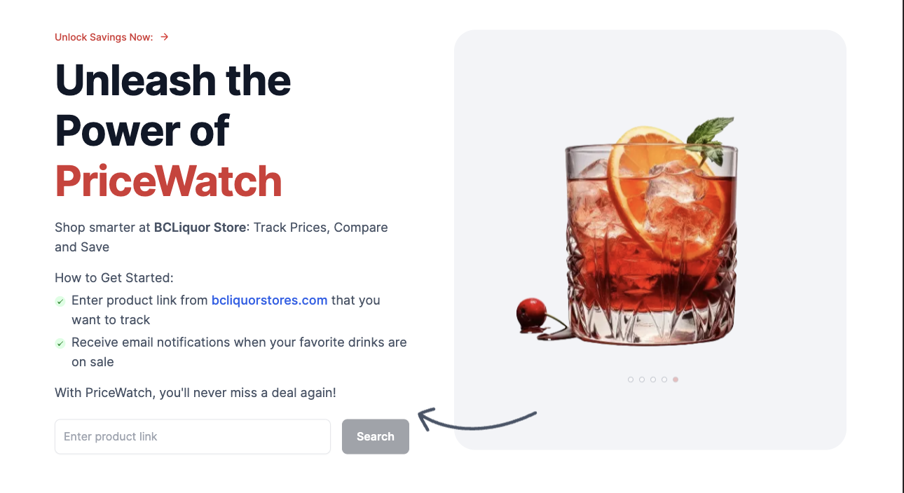

# PriceWatcher - BC Liquor Store Price Tracker

A full-stack web app that tracks product prices on the BC Liquor Store website and sends email alerts when prices drop, products go on sale, or items come back in stock.

## Features

- **Product tracking** - paste any `bcliquorstores.com` product URL to start tracking it
- **Price history** - stores a full timeline of price changes with lowest, highest, and average stats
- **Email alerts** - get notified automatically when:
  - A product hits its all-time lowest price
  - A product comes back in stock
  - A discount exceeds 40%
  - You subscribe to a product (welcome confirmation)
- **Product details** - category, star rating, review count, estimated recommendation rate, and tasting description
- **Automated scraping** - a cron endpoint re-scrapes all tracked products on a schedule without manual intervention

## Tech Stack

| Layer | Tool |
|---|---|
| Framework | Next.js 14 (App Router, Server Actions) |
| Language | TypeScript |
| Database | MongoDB Atlas + Mongoose |
| Scraping | Axios + Cheerio |
| Proxy | BrightData Web Unlocker |
| Email | Nodemailer + Microsoft Outlook SMTP |
| Styling | Tailwind CSS |
| Deployment | Vercel |

## Challenges & Trade-offs

### BC Liquor Store blocks scrapers
The site actively blocks automated requests. Solved by routing all scraping through **BrightData's Web Unlocker** proxy, which handles IP rotation and browser fingerprinting. Trade-off: adds latency per scrape and has a usage cost - acceptable given the low scrape frequency (hourly cron).

### No direct "recommendation rate" metric
The BC Liquor Store shows star ratings and review counts, but no "% recommended" figure. Implemented an **estimation formula** that maps average star rating to an approximate recommendation percentage using tiered linear interpolation. It's an approximation, not ground truth - good enough for UX context, not for analytics.

### HTML entities in category names
The site encodes some category names as HTML entities in structured data (e.g. `COOLERS &amp; CIDERS`). Added explicit decoding in the scraper to normalize these before saving to the database.

### Vercel's 10-second function limit
The free Vercel plan caps serverless function execution at 10 seconds. The cron endpoint scrapes products serially with `Promise.all`, so the limit is only hit if many products are tracked simultaneously. Trade-off: no retry logic on individual failures - if one scrape times out, the rest of that batch may not complete.

### Price field fallback
Some products have a sale price and a regular price; others only have one. Scraped `currentPrice` and `originalPrice` fall back to each other when one is missing, so the UI always has something to display without crashing.

